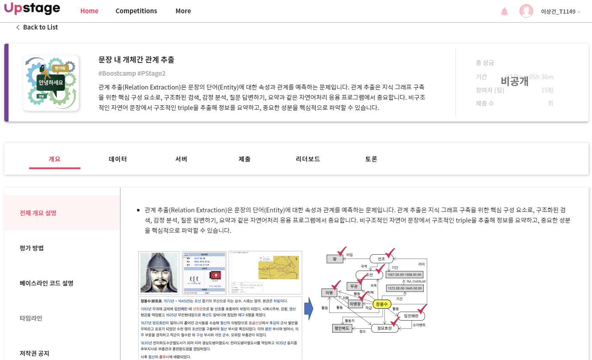
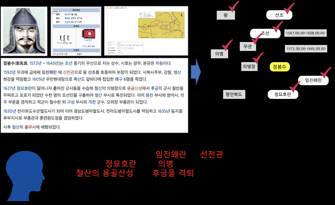
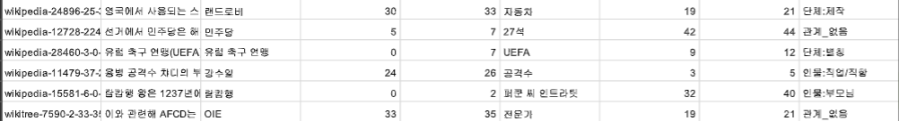
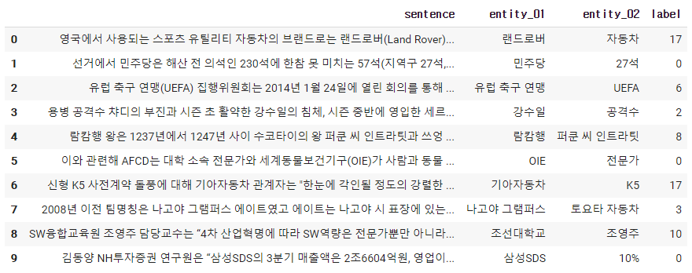
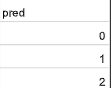

# ai tech boostcamp
# P-stage 2 (KLUE)
## 문장 내 개체간 관계 추출

  

<object data="부스트캠프 랩업 리포트 pstage2.pdf" type="application/pdf" width="700px" height="700px">
    <embed src="부스트캠프 랩업 리포트 pstage2.pdf">
        <p><a href="부스트캠프 랩업 리포트 pstage2.pdf">부스트캠프 랩업 리포트.pdf</a></p>
    </embed>
</object>

<object data="P-stage2 발표용.pdf" type="application/pdf" width="700px" height="700px">
    <embed src="P-stage2 발표용.pdf">
        <p><a href="P-stage2 발표용.pdf">피어세션 발표.pdf</a></p>
    </embed>
</object>  

<li>관계 추출(Relation Extraction)은 문장의 단어(Entity)에 대한 속성과 관계를 예측하는 문제입니다. 관계 추출은 지식 그래프 구축을 위한 핵심 구성 요소로, 구조화된 검색, 감정 분석, 질문 답변하기, 요약과 같은 자연어처리 응용 프로그램에서 중요합니다. 비구조적인 자연어 문장에서 구조적인 triple을 추출해 정보를 요약하고, 중요한 성분을 핵심적으로 파악할 수 있습니다.</li>



위 그림의 예시와 같이 요약된 정보를 사용해 QA 시스템 구축과 활용이 가능하며, 이외에도 요약된 언어 정보를 바탕으로 효율적인 시스템 및 서비스 구성이 가능합니다.

이번 대회에서는 문장, 엔티티, 관계에 대한 정보를 통해 ,문장과 엔티티 사이의 관계를 추론하는 모델을 학습시킵니다. 이를 통해 우리의 인공지능 모델이 엔티티들의 속성과 관계를 파악하며 개념을 학습할 수 있습니다. 우리의 model이 정말 언어를 잘 이해하고 있는 지, 평가해 보도록 합니다.

<li>input: sentence, entity1, entity2 의 정보를 입력으로 사용 합니다.</li>
<blockquote>
sentence: 오라클(구 썬 마이크로시스템즈)에서 제공하는 자바 가상 머신 말고도 각 운영 체제 개발사가 제공하는 자바 가상 머신 및 오픈소스로 개발된 구형 버전의 온전한 자바 VM도 있으며, GNU의 GCJ나 아파치 소프트웨어 재단(ASF: Apache Software Foundation)의 하모니(Harmony)와 같은 아직은 완전하지 않지만 지속적인 오픈 소스 자바 가상 머신도 존재한다.  

entity 1: 썬 마이크로시스템즈  
entity 2: 오라클  

relation: 단체:별칭
</blockquote>
<li>output: relation 42개 classes 중 1개의 class를 예측한 값입니다.</li>

<li>위 예시문에서 단체:별칭의 label은 6번(아래 label_type.pkl 참고)이며, 즉 모델이 sentence, entity 1과 entity 2의 정보를 사용해 label 6을 맞추는 분류 문제입니다.</li>

## 학습 데이터 개요
전체 데이터에 대한 통계는 다음과 같습니다. 학습에 사용될 수 있는 데이터는 train.tsv 한 가지 입니다. 주어진 데이터의 범위 내 혹은 사용할 수 있는 외부 데이터를 적극적으로 활용하세요!
train.tsv: 총 9000개  
test.tsv: 총 1000개 (정답 라벨 blind)  
answer: 정답 라벨 (비공개)  

학습을 위한 데이터는 총 9000개 이며, 1000개의 test 데이터를 통해 리더보드 순위를 갱신합니다. private 리더보드는 운영하지 않는 점 참고해 주시기바랍니다.  
label_type.pkl: 총 42개 classes (class는 아래와 같이 정의 되어 있며, 평가를 위해 일치 시켜주시길 바랍니다.) pickle로 load하게 되면, 딕셔너리 형태의 정보를 얻을 수 있습니다.

<pre>
<code>
with open('./dataset/label_type.pkl', 'rb') as f:
    label_type = pickle.load(f)

{'관계_없음': 0, '인물:배우자': 1, '인물:직업/직함': 2, '단체:모회사': 3, '인물:소속단체': 4, '인물:동료': 5, '단체:별칭': 6, '인물:출신성분/국적': 7, '인물:부모님': 8, '단체:본사_국가': 9, '단체:구성원': 10, '인물:기타_친족': 11, '단체:창립자': 12, '단체:주주': 13, '인물:사망_일시': 14, '단체:상위_단체': 15, '단체:본사_주(도)': 16, '단체:제작': 17, '인물:사망_원인': 18, '인물:출생_도시': 19, '단체:본사_도시': 20, '인물:자녀': 21, '인물:제작': 22, '단체:하위_단체': 23, '인물:별칭': 24, '인물:형제/자매/남매': 25, '인물:출생_국가': 26, '인물:출생_일시': 27, '단체:구성원_수': 28, '단체:자회사': 29, '인물:거주_주(도)': 30, '단체:해산일': 31, '인물:거주_도시': 32, '단체:창립일': 33, '인물:종교': 34, '인물:거주_국가': 35, '인물:용의자': 36, '인물:사망_도시': 37, '단체:정치/종교성향': 38, '인물:학교': 39, '인물:사망_국가': 40, '인물:나이': 41} 
</code>
</pre>
<b>Data 예시</b>  
  
<li>column 1: 데이터가 수집된 정보.</li>
<li>column 2: sentence.</li>
<li>column 3: entity 1</li>
<li>column 4: entity 1의 시작 지점.</li>
<li>column 5: entity 1의 끝 지점.</li>
<li>column 6: entity 2</li>
<li>column 7: entity 2의 시작 지점.</li>
<li>column 8: entity 2의 끝 지점.</li>
<li>column 9: entity 1과 entity 2의 관계를 나타내며, 총 42개의 classes가 존재함.</li>

class에 대한 정보는 위 label_type.pkl를 따라 주시기 바랍니다.

## Components
* code 설명
    * train.py
        * baseline code를 학습시키기 위한 파일입니다.
        * 저장된 model관련 파일은 results 폴더에 있습니다.
  * inference.py
    * 학습된 model을 통해 prediction하며, 예측한 결과를 csv 파일로 저장해줍니다.
    * 저장된 파일은 prediction 폴더에 있습니다.
  * load_data.py
    * baseline code의 전처리와 데이터셋 구성을 위한 함수들이 있는 코드입니다.
  * ~~eval_acc.py~~
     * ~~public leaderboard와의 정답을 비교해 정확도를 알려줍니다.~~
  * train.py
    * 모델을 훈련시킵니다.
  * data_premaking1~8.ipynb
    * 주어진 훈련데이터를 분석하고, 외부 데이터를 훈련데이터 형식에 맞도록 가공시키기 위해 만들었습니다.
  * inference_ensemble.py
    * 훈련한 모델끼리 앙상블을 수행하기 위해 만들었습니다.
    * soft voting 방식을 이용합니다.
       

<b>폴더 설명</b>
* ~~dataset~~
    * ~~학습과 평가를 위한 data들이 담긴 폴더 입니다.~~
    * ~~train 폴더의 데이터를 사용해 학습 시켜 주세요.~~
* ~~logs~~
    * ~~텐서보드 로그가 담기는 폴더 입니다.~~
* prediction
    * inference.py 를 통해 model이 예측한 정답 submission.csv 파일이 저장되는 폴더 입니다.
* results
    * train.py를 통해 설정된 step 마다 model이 저장되는 폴더 입니다.

<b>베이스라인 코드 설명</b>
* 이번 competition의 베이스라인의 코드는 huggingface를 사용한 bert-base-multilingual-cased model을 바탕으로 작성 되었습니다.
* 베이스라인에 사용한 전처리된 Dataset sample 입니다.sentence, entity01, entity02를 model의 input으로 입력 받아, 42개의 classes 중 1개를 예측하도록 합니다.

* 간단하게 entity01, entity02, sentence를 special token인 [SEP]을 활용해 분리하고, model의 input으로 사용했습니다.
* ※ 주어진 train.tsv 파일은 의도적으로 label을 포함하지 않은 raw dataset으로 제공합니다. baseline에서 벗어나 자유로운 시도를 하고 싶다면, 경우에 따라 label_type.pkl를 사용해 직접 전처리 작업을 하셔야 합니다.
* ex) [CLS] entity01 [SEP] entity02 [SEP] sentence [SEP]
```
['[CLS]', 'UN', '##M', '[SEP]', '미국', '[SEP]', '세계', '대학', '학', '##술', '순', '##위', '(', 'Academic', 'Ranking', 'of', 'World', 'Universities', ')', '에서', '##는', 'UN', '##M', '##을', '세계', '##순', '##위', '201', '-', '300', '##위로', '발', '##표', '##했고', '미국', '내', '순', '##위로', '##는', '90', '-', '110', '##위로', '발', '##표', '##했다', '.', '[SEP]',]
```
1. <b>라이브러리 설치</b>
압축을 푼 후 아래 명령어를 실행해 필요한 라이브러리를 설치해 줍니다.
```
pip install -r requirements.txt
```

2. <b>Training</b>
기본으로 설정된 hyperparameter로 train.py 실행합니다.
baseline code에서는 500 step마다 logs 폴더와 results 폴더에 각각 텐서보드 기록과 model이 저장됩니다.
```
python train.py
```
3. <b>Inference</b>
학습된 모델을 추론합니다.
제출을 위한 csv 파일을 만들고 싶은 model의 경로를 model_dir에 입력해 줍니다.
오류 없이 진행 되었다면, ./prediction/pred_answer.csv 파일이 생성 됩니다.
생성된 파일을 제출해 주시기 바랍니다.

```
python inference.py --model_dir=./results/checkpoint-500
```

제출할 csv 파일은 반드시 column명이 pred로 되어야 하며, 각 행은 예측된 classes 값들 입니다.

  


## 렙업 리포트


## 피어세션 발표


